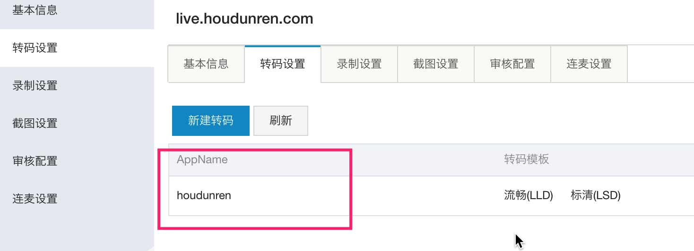

# 阿里云

提供了常用的阿里云服务操作方法，是对阿里云[官网SDK](https://help.aliyun.com/document_detail/53111.html)的封装，整体使用安装可靠。

## 配置
```
\Houdunwang\Aliyun\Config::config([
    /*
    |--------------------------------------------------------------------------
    | 根据服务器所在区域进行选择
    | https://help.aliyun.com/document_detail/40654.html?spm=5176.7114037.1996646101.1.OCtdEo
    */
    'regionId'  => 'cn-hangzhou',
    /*
    |--------------------------------------------------------------------------
    | 如果使用主账号访问，登陆阿里云 AccessKey 管理页面创建、查看
    | 如果使用子账号访问，请登录阿里云访问控制控制台查看
    */
    'accessId'  => '',
    /*
    |--------------------------------------------------------------------------
    | 如果使用主账号访问，登陆阿里云 AccessKey 管理页面创建、查看
    | 如果使用子账号访问，请登录阿里云访问控制控制台查看
    */
    'accessKey' => '',
]);
```

## 直播

### 1. 推流地址

**方法说明**

```
\houdunwang\aliyun\Aliyun::instance('Live')->push($url, $key, $hour)
```

**参数说明**

| 参数  | 说明                                                       |
| ----- | ---------------------------------------------------------- |
| $url  | 直播链接                                                   |
| $key  | 加密密钥                                                   |
| $hour | 生成的链接地址从重成开始可以使用时间，超过这个时间将无效。 |

**使用示例**

```
$url    = 'rtmp://video-center.alivecdn.com/houdunren/app?vhost=live.houdunren.com';
\houdunwang\aliyun\Aliyun::instance('Live')->push($url,'houdunwang',5);
```
 **$url 变量说明**



| 变量      | 说明                                   |
| --------- | -------------------------------------- |
| houdunren | 直播流所属应用名称，登录阿里云后台查看 |
| app       | 直播流名称，可自定义                   |
| vhost     | 直播域名，登录阿里云后台进行查看       |

### 2. OBS直播

生成推流地址后就可以在OBS或斗鱼等支持推流的软件中直播了。

下面是在第一步中生成的推流地址

```
rtmp://video-center.alivecdn.com/houdunren/app?vhost=live.houdunren.com&auth_key=1535386359-0-0-3965dab64f78652053b0859e4df14d14
```

下面是OBS中的设置


在阿里云后台查看直播状态


### 3. 直播通知

直播通知用于开启直播后向指定地址发送消息。[官方文档](https://help.aliyun.com/document_detail/35415.html?spm=a2c4g.11186623.2.20.1d3386dezPhJBc) 

```
$client  = \Houdunwang\Aliyun\Aliyun::client();
$request = new \live\Request\V20161101\SetLiveStreamsNotifyUrlConfigRequest();
$request->setActionName('SetLiveStreamsNotifyUrlConfig');

//直播域名，登录阿里云后台进行查看
$request->setDomainName('live.houdunren.com');

//服务器通知地址
$request->setNotifyUrl('http://www.houdunren.com/livenotify');
$client->getAcsResponse($request);
```

### 4. 接收通知

请自行通过请求过来的参数处理业务

### 5. 其他接口

直播系统了很多接口，具体请参考[阿里官网手册](https://help.aliyun.com/document_detail/48207.html?spm=5176.7991389.632961.2.G5Hkk9)，下面我以一个接口来讲解使用方法，其他的使用请参考手册，其实就是传递些参数而已。

查看某个域名下所有流的信息

```
//实例化直播对象
$request = new \live\Request\V20161101\DescribeLiveStreamsPublishListRequest();

//下面是根据手册设置的参数，具体参数含义请查看手册
$request->setActionName('DescribeLiveStreamsPublishList');
$request->setDomainName('live.houdunren.com');
$request->setStartTime(\Carbon\Carbon::instance(new DateTime('2017-05-22 3:33:12'))->format('Y-m-d\TH:i:s\Z'));
$request->setEndTime(\Carbon\Carbon::instance(new DateTime('2017-05-23 3:33:12'))->format('Y-m-d\TH:i:s\Z'));

//发送请求
$response = \Houdunwang\Aliyun\Aliyun::client()->getAcsResponse($request);
print_r($response);
```

## 邮件
```
//阿里云请求实例
$request = new \Dm\Request\V20151123\SingleSendMailRequest();

//控制台创建的发信地址
$request->setAccountName("edu@vip.houdunren.com");
//发信人昵称
$request->setFromAlias("后盾向军");
$request->setAddressType(1);
$request->setTagName("控制台创建的标签");
$request->setReplyToAddress("true");
$request->setToAddress("2300071698@qq.com");
$request->setSubject("邮件主题-后盾人");
$request->setHtmlBody("邮件正文-后盾人 人人做后盾");

try {
	//发送请求
	$response = \Houdunwang\Aliyun\Aliyun::client()->getAcsResponse($request);
	print_r($response);
} catch (ClientException  $e) {
	print_r($e->getErrorCode());
	print_r($e->getErrorMessage());
} catch (ServerException  $e) {
	print_r($e->getErrorCode());
	print_r($e->getErrorMessage());
}
```


## 短信